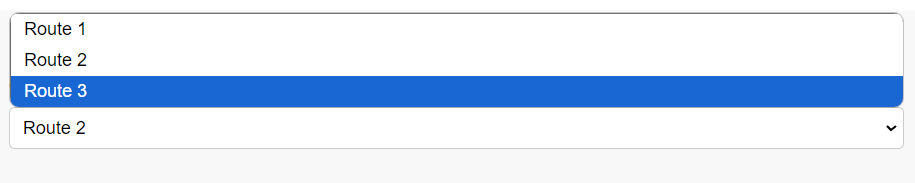
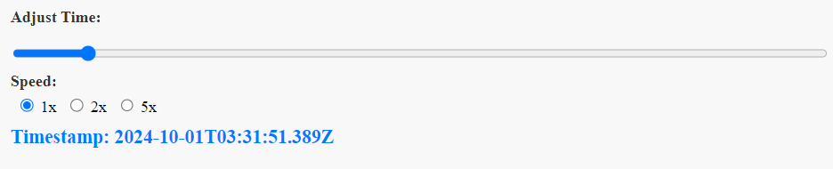

# RouteVision

## Description
RouteVision is a dynamic web application that provides real-time vehicle tracking and visualization on interactive maps. Designed for seamless route management, it showcases a vehicle’s live location, movement, and route progression over time, using powerful mapping technologies.


## Deployment

RouteVision has been successfully deployed on Render. You can access the live application using the link below:

#### RouteVision Application
    
https://routevision-1.onrender.com/

Feel free to explore the features and functionality of the application directly from the deployed site.


## Features
- Multiple routes
- API endpoint for each route
- Timestamp mechanism
- Modular code
- Simple and well documented
- Speed multiplier
- Intuitive frontend


## Technologies Used
- **Flask**: The web framework used for building the application.
- **Mapbox API**: Used for the creation of data JSON (one-time usage).
- **Leaflet**: A library for interactive maps.

## Usage

1. **Run the Application**:
   - Ensure you have your virtual environment activated.
   - Navigate to the project directory.
   - Start the Flask application by running:
     ```bash
     flask run
     ```

2. **Access the Application**:
   - Open your web browser and go to `http://localhost:5000`.

3. **Choose a Route**:
   - Once the application is loaded, you will see a dropdown menu to select a route.
   - Select the desired route from the list.

4. **Adjust Speed and Timestamp**:
   - Use the speed controls to set your desired playback speed (1x, 2x, 5x).
   - Adjust the timestamp slider to visualize the vehicle's movement at different times.

5. **Visualize the Tracking**:
   - The map will display the vehicle's live location and route progression based on the selected parameters.


## Deployment Instructions

To deploy the **RouteVision** application on Render, follow these steps:

1. **Create a New Web Service**:
   - Log in to your Render account.
   - Click on "New" and select "Web Service."

2. **Connect Your Repository**:
   - Select the repository where your RouteVision project is hosted on GitHub.
   - Choose the branch you want to deploy (e.g., `main`).

3. **Configure the Service**:
   - **Name**: Give your service a name (e.g., `route-vision`).
   - **Environment**: Choose `Python`.
   - **Build Command**: Leave this blank.
   - **Start Command**: Use the following command:
     ```bash
     gunicorn app:app
     ```
   (Make sure your main Flask app file is named `app.py` or adjust accordingly.)


5. **Deploy**:
   - Click on the "Create Web Service" button to start the deployment.
   - Wait for the deployment process to complete. You will receive a live URL for your application.

6. **Access Your Deployed Application**:
   - After deployment, open the provided URL to access your RouteVision app.


## Project Decisions

The following decisions were made during the development of the RouteVision application:

1. **Choice of Framework**:
   - **Flask** was chosen as the backend framework due to its simplicity and lightweight nature. Given the project's requirements and the time constraints, using a more complex framework like **Django** or a Node.js backend with **Express** was deemed unnecessary.

2. **Data Handling**:
   - Instead of relying on synthetic route data, the **Mapbox API** was utilized to generate the route coordinates. This approach ensured accurate and real-time data. The raw data obtained was then cleaned and processed according to the application's needs. 

3. **Modularity**:
   - The codebase was designed to be modular, promoting better organization and maintainability. This decision allows for easier updates and feature enhancements in the future.

4. **Documentation**:
   - Emphasis was placed on creating simple and clear documentation to assist users and developers in understanding the application’s functionalities and setup procedures.

5. **User Experience**:
   - An intuitive frontend was developed to ensure a smooth user experience, allowing users to easily select routes, adjust speed, and view timestamps.


## Images

Here are some images showcasing the RouteVision application in action:


*Route Visualization*


*Route Select Interface*


*Timestamp Adjustment Feature*

*More images can be added as needed.*


### Acknowledgments

- **Mapbox**: For providing the powerful mapping API that enabled the visualization of routes and vehicle tracking.
- **Leaflet**: For the easy-to-use library that allowed for interactive map features.
- **Flask**: For being a lightweight framework that suited the project’s needs effectively.
- **OpenStreetMap**: For the underlying map data used in the application.
- **Any other contributors or libraries** you want to acknowledge.
